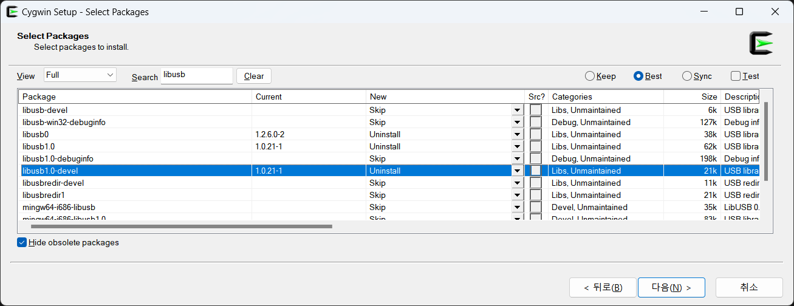

# Table of Contents
- [Table of Contents](#table-of-contents)
- [Prepare to build libmtp](#prepare-to-build-libmtp)
  - [Install Cygwin \& dependencies](#install-cygwin--dependencies)
  - [Build libusb](#build-libusb)
- [Build libmtp](#build-libmtp)
  - [Troubleshooting](#troubleshooting)
  - [Bulid](#bulid)
- [Build application using libmtp](#build-application-using-libmtp)
  - [Build test](#build-test)
- [Summary for building libmtp](#summary-for-building-libmtp)
- [Summary for building development environment](#summary-for-building-development-environment)


# Prepare to build libmtp

## Install Cygwin & dependencies

To build libmtp on Windows, you need to use MinGW. To use MinGW, install Cygwin. After installing Cygwin, you will be prompted to set up a proxy server to install various packages.


You can choose anything you want. Then, complete the installation without installing any packages.

Then you can use the downloaded Cygwin installation file, `setup-x86_64.exe`, and enter the following command.

```bash
.\setup-x86_64.exe -q -P libtool,m4,automake,libiconv-devel,gettext-devel,libusb1.0-devel,wget,gcc-g++,make,git
```

## Build libusb

The libusb installed by Cygwin is not the compatible version as the libusb used by libmtp, which causes errors during compilation. Therefore, in order to build libmtp, it is necessary to build libusb. Enter the command below to build libusb.

```bash
cd ~ && mkdir build_libmtp 
cd build_libmtp
git clone https://github.com/libusb/libusb.git
cd libusb
./autogen.sh && make
```

After the build is complete, look in `~/build_libmtp/libusb/libusb/.libs` and you will see `cygusb-1.0.dll`, `libusb-1.0.a`, and `libusb-1.0.dll.a`. Enter the following commands to move these files to `~/build_libmtp/dep/lib` and move `~/build_libmtp/libusb/libusb.h` to `~/build_libmtp/dep/include`.

```bash
cd ~/build_libmtp && mkdir dep
cd dep && mkdir include && mkdir lib
cd ~/build_libmtp
cp libusb/libusb/.libs/cygusb-1.0.dll dep/lib
cp libusb/libusb/.libs/libusb-1.0.a dep/lib
cp libusb/libusb/.libs/libusb-1.0.dll.a dep/lib
cp libusb/libusb/libusb.h dep/include
```

# Build libmtp

Enter the following commands to create a configure file and a Makefile to build libmtp.

```bash
cd ~/build_libmtp
git clone https://github.com/libmtp/libmtp.git
cd libmtp
./autogen.sh && make
```

In my case, I got the following error

```bash
/bin/sh ../libtool  --tag=CC   --mode=compile gcc -DHAVE_CONFIG_H -I. -I..    -I/usr/include/libusb-1.0 -g -O2 -Wall -Wmissing-prototypes -MT libmtp_la-libusb1-glue.lo -MD -MP -MF .deps/libmtp_la-libusb1-glue.Tpo -c -o libmtp_la-libusb1-glue.lo `test -f 'libusb1-glue.c' || echo './'`libusb1-glue.c
libtool: compile:  gcc -DHAVE_CONFIG_H -I. -I.. -I/usr/include/libusb-1.0 -g -O2 -Wall -Wmissing-prototypes -MT libmtp_la-libusb1-glue.lo -MD -MP -MF .deps/libmtp_la-libusb1-glue.Tpo -c libusb1-glue.c  -DDLL_EXPORT -DPIC -o .libs/libmtp_la-libusb1-glue.o
libusb1-glue.c: In function 'init_usb':
libusb1-glue.c:167:5: warning: implicit declaration of function 'libusb_set_option'; did you mean 'libusb_get_version'? [-Wimplicit-function-declaration]
  167 |     libusb_set_option(libmtp_libusb_context, LIBUSB_OPTION_LOG_LEVEL,  LIBUSB_LOG_LEVEL_DEBUG ); /* highest level */
      |     ^~~~~~~~~~~~~~~~~
      |     libusb_get_version
libusb1-glue.c:167:46: error: 'LIBUSB_OPTION_LOG_LEVEL' undeclared (first use in this function)
  167 |     libusb_set_option(libmtp_libusb_context, LIBUSB_OPTION_LOG_LEVEL,  LIBUSB_LOG_LEVEL_DEBUG ); /* highest level */
      |                                              ^~~~~~~~~~~~~~~~~~~~~~~
libusb1-glue.c:167:46: note: each undeclared identifier is reported only once for each function it appears in
```

## Troubleshooting

The above error occurs because the version of libusb is incompatible with the version used by libmtp. To fix this, first remove libusb from Cygwin. This can be done by using the Cygwin installation file `setup-x86_64.exe` to remove all packages related to libusb.

You can do this by setting View to Full, searching for libusb, and replacing New in the package with Current with Uninstall.



Next, enter the following command to change the location of libusb in libmtp's makefile.

```bash
cd ~/build_libmtp/libmtp
sed -i 's\-I/usr/include/libusb-1.0\-I$${HOME}/build_libmtp/dep/include -L$${HOME}/build_libmtp/dep/lib\g' ./Makefile
sed -i 's\-I/usr/include/libusb-1.0\-I$${HOME}/build_libmtp/dep/include -L$${HOME}/build_libmtp/dep/lib\g' ./src/Makefile
```

## Bulid

Now, to build libmtp, you can type the following command

```bash
make
```

When the build is complete, `cygmtp-9.dll`, `libmtp.a`, and `libmtp.dll.a` exist in `~/build_libmtp/libmtp/src/.libs`. Enter the following command to move these files to `~/build_libmtp/dep/lib` and move `~/build_libmtp/libmtp/src/libmtp.h` to `~/build_libmtp/dep/include`.

```bash
cd ~/build_libmtp
cp libmtp/src/.libs/cygmtp-9.dll dep/lib
cp libmtp/src/.libs/libmtp.a dep/lib
cp libmtp/src/.libs/libmtp.dll.a dep/lib
cp libmtp/src/libmtp.h dep/include
```

Finally, save the dep folder to `/usr/libmtp` for future convenience.

```bash
cp ~/build_libmtp/dep /usr/libmtp -r
```

# Build application using libmtp

To create an application that uses libmtp, it is convenient to create a directory structure that looks like this

```bash
<application folder>
│  build.sh
│
├─bin
│      cyggcc_s-seh-1.dll
│      cygiconv-2.dll
│      cygmtp-9.dll
│      cygstdc++-6.dll
│      cygusb-1.0.dll
│      cygwin1.dll
│
└─src
```

The command to create the above structure is following:

```bash
mkdir src
mkdir bin
cp /usr/libmtp/lib/cygmtp-9.dll /usr/libmtp/lib/cygusb-1.0.dll ./bin
cp /bin/cygwin1.dll /bin/cygiconv-2.dll /bin/cygstdc++-6.dll /bin/cyggcc_s-seh-1.dll ./bin

cat << EOF > build.sh
#!/bin/sh

gcc \$1 -I /usr/libmtp/include -L /usr/libmtp/lib -lmtp -o \$2
EOF

chmod 754 ./build.sh

cat << EOF > build++.sh
#!/bin/sh

g++ \$1 -I /usr/libmtp/include -L /usr/libmtp/lib -lmtp -o \$2
EOF

chmod 754 ./build++.sh
```

You can write your program in src and then compile it with the following command.

```bash
./build.sh ./src/<target> ./bin/<out>
./build++.sh ./src/<target> ./bin/<out>
```

## Build test

To verify that it compiles correctly, write the following source code in src.

```c
// test.c
// source: https://github.com/libmtp/libmtp/blob/master/examples/filetree.c
#include <libmtp.h>

int main (int argc, char **argv)
{
  LIBMTP_raw_device_t * rawdevices;
  int numrawdevices;
  LIBMTP_error_number_t err;
  int i;

  LIBMTP_Init();

  err = LIBMTP_Detect_Raw_Devices(&rawdevices, &numrawdevices);
  switch(err) {
  case LIBMTP_ERROR_NO_DEVICE_ATTACHED:
    fprintf(stdout, "   No raw devices found.\n");
    return 0;
  case LIBMTP_ERROR_CONNECTING:
    fprintf(stderr, "Detect: There has been an error connecting. Exiting\n");
    return 1;
  case LIBMTP_ERROR_MEMORY_ALLOCATION:
    fprintf(stderr, "Detect: Encountered a Memory Allocation Error. Exiting\n");
    return 1;
  case LIBMTP_ERROR_NONE:
    break;
  case LIBMTP_ERROR_GENERAL:
  default:
    fprintf(stderr, "Unknown connection error.\n");
    return 1;
  }
}
```

Then compile it with the following command

```bash
./build.sh ./src/test.c ./bin/test
```

If it compiled successfully, `bin/test.exe` should exist. If you remove all MTP devices and then run the program, you should see the following message.

> [!IMPORTANT]
> It should be run from a Windows terminal, not cygwin.
> If you want to run it in cygwin, you can remove `bin/cygwin1.dll`, `bin/cygstdc++-6.dll`, and `bin/cyggcc_s-seh-1.dll`.

```bash
PS ?\bin> .\test.exe
   No raw devices found.
```

# Summary for building libmtp

> Install Cygwin.
> Then enter following commands.

```bash
.\setup-x86_64.exe -q -P libtool,m4,automake,libiconv-devel,gettext-devel,libusb1.0-devel,wget,gcc-g++,make,git
```

> Then enter following commands in Cygwin.

```bash
cd ~ && mkdir build_libmtp 
cd build_libmtp
git clone https://github.com/libusb/libusb.git
cd libusb
./autogen.sh && make

cd ~/build_libmtp && mkdir dep
cd dep && mkdir include && mkdir lib
cd ~/build_libmtp
cp libusb/libusb/.libs/cygusb-1.0.dll dep/lib
cp libusb/libusb/.libs/libusb-1.0.a dep/lib
cp libusb/libusb/.libs/libusb-1.0.dll.a dep/lib
cp libusb/libusb/libusb.h dep/include

cd ~/build_libmtp
git clone https://github.com/libmtp/libmtp.git
cd libmtp
./autogen.sh && make
```

> Remove libusb-related packages from Cygwin[^1].
> Then enter following commands on Cygwin.

```bash
cd ~/build_libmtp/libmtp
sed -i 's\-I/usr/include/libusb-1.0\-I$${HOME}/build_libmtp/dep/include -L$${HOME}/build_libmtp/dep/lib\g' ./Makefile
sed -i 's\-I/usr/include/libusb-1.0\-I$${HOME}/build_libmtp/dep/include -L$${HOME}/build_libmtp/dep/lib\g' ./src/Makefile

make

cd ~/build_libmtp
cp libmtp/src/.libs/cygmtp-9.dll dep/lib
cp libmtp/src/.libs/libmtp.a dep/lib
cp libmtp/src/.libs/libmtp.dll.a dep/lib
cp libmtp/src/libmtp.h dep/include

cp ~/build_libmtp/dep /usr/libmtp -r
```

# Summary for building development environment

> Create a directory where you want to create your application, and navigate to it.

```bash
mkdir src
mkdir bin
cp /usr/libmtp/lib/cygmtp-9.dll /usr/libmtp/lib/cygusb-1.0.dll ./bin
cp /bin/cygwin1.dll /bin/cygiconv-2.dll /bin/cygstdc++-6.dll /bin/cyggcc_s-seh-1.dll ./bin

cat << EOF > build.sh
#!/bin/sh

gcc \$1 -I /usr/libmtp/include -L /usr/libmtp/lib -lmtp -o \$2
EOF

chmod 754 ./build.sh

cat << EOF > build++.sh
#!/bin/sh

g++ \$1 -I /usr/libmtp/include -L /usr/libmtp/lib -lmtp -o \$2
EOF

chmod 754 ./build++.sh
```

> Write the desired code in src.

```bash
./build.sh ./src/<target> ./bin/<out>
./build++.sh ./src/<target> ./bin/<out>
```

[^1]: #troubleshooting