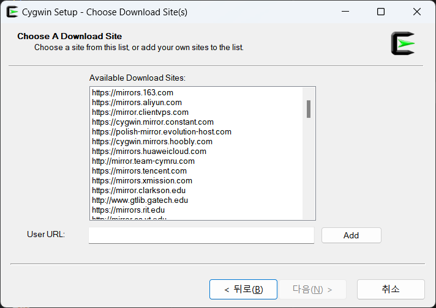
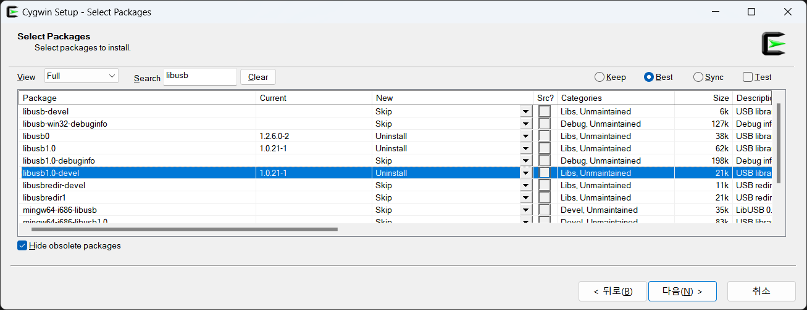

# Table of Contents
- [Table of Contents](#table-of-contents)
- [Prepare to build libmtp](#prepare-to-build-libmtp)
  - [Install Cygwin \& dependencies](#install-cygwin--dependencies)
  - [Build libusb](#build-libusb)
- [Build libmtp](#build-libmtp)
  - [Troubleshooting](#troubleshooting)
  - [Bulid](#bulid)
- [Build application using libmtp](#build-application-using-libmtp)
  - [Build test](#build-test)
- [Summary for building libmtp](#summary-for-building-libmtp)
- [Summary for building development environment](#summary-for-building-development-environment)


# Prepare to build libmtp

## Install Cygwin & dependencies

윈도우에서 libmtp를 빌드하기 위해서는 MinGW를 사용해야 한다. MinGW를 사용하기 위해 Cygwin을 설치한다. Cygwin을 설치하다 보면, 각종 패키지를 설치할 프록시 서버를 설정하려고 다음과 같은 창이 나타난다.



적당히 아무거나 선택해도 패키지는 정상적으로 설치되므로 아무거나 선택한다. (다만, 잘못 선택하면 속도가 느릴 수 있다.) 그 뒤, 아무런 패키지도 설치하지 않고 설치를 완료한다.

설치가 완료되면 다운로드 받은 Cygwin 설치 파일인 `setup-x86_64.exe`을 사용해서 다음과 같은 명령어를 입력하면 된다.

```bash
.\setup-x86_64.exe -q -P libtool,m4,automake,libiconv-devel,gettext-devel,libusb1.0-devel,wget,gcc-g++,make,git
```

## Build libusb

Cygwin에서 설치되는 libusb는 libmtp에서 사용하는 libusb와 버전이 맞지 않아 컴파일 과정에서 오류가 발생한다. 따라서 libmtp를 빌드하기 위해서는 libusb를 빌드할 필요가 있다. 아래의 명령어를 입력하면, libusb를 빌드한다.

```bash
cd ~ && mkdir build_libmtp 
cd build_libmtp
git clone https://github.com/libusb/libusb.git
cd libusb
./autogen.sh && make
```

빌드가 완료된 후, `~/build_libmtp/libusb/libusb/.libs`를 보면 `cygusb-1.0.dll`와 `libusb-1.0.a`, `libusb-1.0.dll.a`가 존재한다. 이 파일들을 `~/build_libmtp/dep/lib`로 옮기고, `~/build_libmtp/libusb/libusb/libusb.h`를 `~/build_libmtp/dep/include`로 옮기기 위해 다음 명령어를 입력한다. 

```bash
cd ~/build_libmtp && mkdir dep
cd dep && mkdir include && mkdir lib
cd ~/build_libmtp
cp libusb/libusb/.libs/cygusb-1.0.dll dep/lib
cp libusb/libusb/.libs/libusb-1.0.a dep/lib
cp libusb/libusb/.libs/libusb-1.0.dll.a dep/lib
cp libusb/libusb/libusb.h dep/include
```

# Build libmtp

libmtp를 빌드하기 위한, configure파일과 Makefile을 만들기 위해 다음 명령어를 입력한다.

```bash
cd ~/build_libmtp
git clone https://github.com/libmtp/libmtp.git
cd libmtp
./autogen.sh && make
```

내 경우 다음과 같은 오류가 발생했다.

```bash
/bin/sh ../libtool  --tag=CC   --mode=compile gcc -DHAVE_CONFIG_H -I. -I..    -I/usr/include/libusb-1.0 -g -O2 -Wall -Wmissing-prototypes -MT libmtp_la-libusb1-glue.lo -MD -MP -MF .deps/libmtp_la-libusb1-glue.Tpo -c -o libmtp_la-libusb1-glue.lo `test -f 'libusb1-glue.c' || echo './'`libusb1-glue.c
libtool: compile:  gcc -DHAVE_CONFIG_H -I. -I.. -I/usr/include/libusb-1.0 -g -O2 -Wall -Wmissing-prototypes -MT libmtp_la-libusb1-glue.lo -MD -MP -MF .deps/libmtp_la-libusb1-glue.Tpo -c libusb1-glue.c  -DDLL_EXPORT -DPIC -o .libs/libmtp_la-libusb1-glue.o
libusb1-glue.c: In function 'init_usb':
libusb1-glue.c:167:5: warning: implicit declaration of function 'libusb_set_option'; did you mean 'libusb_get_version'? [-Wimplicit-function-declaration]
  167 |     libusb_set_option(libmtp_libusb_context, LIBUSB_OPTION_LOG_LEVEL,  LIBUSB_LOG_LEVEL_DEBUG ); /* highest level */
      |     ^~~~~~~~~~~~~~~~~
      |     libusb_get_version
libusb1-glue.c:167:46: error: 'LIBUSB_OPTION_LOG_LEVEL' undeclared (first use in this function)
  167 |     libusb_set_option(libmtp_libusb_context, LIBUSB_OPTION_LOG_LEVEL,  LIBUSB_LOG_LEVEL_DEBUG ); /* highest level */
      |                                              ^~~~~~~~~~~~~~~~~~~~~~~
libusb1-glue.c:167:46: note: each undeclared identifier is reported only once for each function it appears in
```

## Troubleshooting

위 에러는 libusb의 버전이 libmtp에서 사용하는 버전과 맞지 않아서 발생한다. 이를 해결하기 위해, 우선 Cygwin에 깔린 libusb를 제거한다. Cygwin 설치 파일인 `setup-x86_64.exe`를 사용하여 libusb와 관련된 모든 패키지를 제거하면 된다.

View를 Full로 설정하고, libusb를 검색한 뒤에 Current가 있는 패키지의 New를 Uninstall로 바꾸면 된다.



그 뒤, Makefile에 적힌 libusb의 위치를 변경하기 위해 다음 명령어를 입력한다.

```bash
cd ~/build_libmtp/libmtp
sed -i 's\-I/usr/include/libusb-1.0\-I$${HOME}/build_libmtp/dep/include -L$${HOME}/build_libmtp/dep/lib\g' ./Makefile
sed -i 's\-I/usr/include/libusb-1.0\-I$${HOME}/build_libmtp/dep/include -L$${HOME}/build_libmtp/dep/lib\g' ./src/Makefile
```

## Bulid

이제 libmtp를 빌드하기 위해 다음 명령어를 입력하면 된다.

```bash
make
```

빌드가 완료되면, `~/build_libmtp/libmtp/src/.libs`에 `cygmtp-9.dll`, `libmtp.a`, `libmtp.dll.a`가 존재한다. 이 파일들을 `~/build_libmtp/dep/lib`로 옮기고, `~/build_libmtp/libmtp/src/libmtp.h`를 `~/build_libmtp/dep/include`로 옮기기 위해 다음 명령어를 입력한다.

```bash
cd ~/build_libmtp
cp libmtp/src/.libs/cygmtp-9.dll dep/lib
cp libmtp/src/.libs/libmtp.a dep/lib
cp libmtp/src/.libs/libmtp.dll.a dep/lib
cp libmtp/src/libmtp.h dep/include
```

마지막으로 추후 편리함을 위해 dep 폴더를 `/usr/libmtp`에 저장한다.

```bash
cp ~/build_libmtp/dep /usr/libmtp -r
```

# Build application using libmtp

libmtp를 사용하는 어플리케이션을 만들기 위해 다음과 같은 디렉토리 구조를 만들면 편하다.

```bash
<application folder>
│  build.sh
│
├─bin
│      cyggcc_s-seh-1.dll
│      cygiconv-2.dll
│      cygmtp-9.dll
│      cygstdc++-6.dll
│      cygusb-1.0.dll
│      cygwin1.dll
│
└─src
```

위 구조를 만드는 명령어는 다음과 같다.

```bash
mkdir src
mkdir bin
cp /usr/libmtp/lib/cygmtp-9.dll /usr/libmtp/lib/cygusb-1.0.dll ./bin
cp /bin/cygwin1.dll /bin/cygiconv-2.dll /bin/cygstdc++-6.dll /bin/cyggcc_s-seh-1.dll ./bin

cat << EOF > build.sh
#!/bin/sh

gcc \$1 -I /usr/libmtp/include -L /usr/libmtp/lib -lmtp -o \$2
EOF

chmod 754 ./build.sh

cat << EOF > build++.sh
#!/bin/sh

g++ \$1 -I /usr/libmtp/include -L /usr/libmtp/lib -lmtp -o \$2
EOF

chmod 754 ./build++.sh
```

src에 원하는 프로그램을 작성한 뒤, 다음 명령어를 통해 컴파일하면 된다.

```bash
./build.sh ./src/<target> ./bin/<out>
./build++.sh ./src/<target> ./bin/<out>
```

## Build test

정상적으로 컴파일이 되는지 확인하기 위해, src에 다음과 같은 소스코드를 작성한다.

```c
// test.c
// source: https://github.com/libmtp/libmtp/blob/master/examples/filetree.c
#include <libmtp.h>

int main (int argc, char **argv)
{
  LIBMTP_raw_device_t * rawdevices;
  int numrawdevices;
  LIBMTP_error_number_t err;
  int i;

  LIBMTP_Init();

  err = LIBMTP_Detect_Raw_Devices(&rawdevices, &numrawdevices);
  switch(err) {
  case LIBMTP_ERROR_NO_DEVICE_ATTACHED:
    fprintf(stdout, "   No raw devices found.\n");
    return 0;
  case LIBMTP_ERROR_CONNECTING:
    fprintf(stderr, "Detect: There has been an error connecting. Exiting\n");
    return 1;
  case LIBMTP_ERROR_MEMORY_ALLOCATION:
    fprintf(stderr, "Detect: Encountered a Memory Allocation Error. Exiting\n");
    return 1;
  case LIBMTP_ERROR_NONE:
    break;
  case LIBMTP_ERROR_GENERAL:
  default:
    fprintf(stderr, "Unknown connection error.\n");
    return 1;
  }
}
```

그 뒤, 다음 명령어를 통해 컴파일한다.

```bash
./build.sh ./src/test.c ./bin/test
```

정상적으로 컴파일이 됐다면, `bin/test.exe`가 존재한다. 모든 MTP 장치를 제거한 다음, 해당 프로그램을 실행하면 다음과 같은 메세지가 출력된다.

> 주의 : cygwin이 아닌, 윈도우 터미널에서 실행해야 합니다. 
만약, cygwin에서 실행하고 싶다면, `bin/cygwin1.dll`, `bin/cygstdc++-6.dll`, `bin/cyggcc_s-seh-1.dll`을 제거하면 됩니다.

```bash
PS ?\bin> .\test.exe
   No raw devices found.
```

# Summary for building libmtp

> Cygwin을 설치한다.

```bash
.\setup-x86_64.exe -q -P libtool,m4,automake,libiconv-devel,gettext-devel,libusb1.0-devel,wget,gcc-g++,make,git
```

> Cygwin에서 다음 명령어를 입력한다.

```bash
cd ~ && mkdir build_libmtp 
cd build_libmtp
git clone https://github.com/libusb/libusb.git
cd libusb
./autogen.sh && make

cd ~/build_libmtp && mkdir dep
cd dep && mkdir include && mkdir lib
cd ~/build_libmtp
cp libusb/libusb/.libs/cygusb-1.0.dll dep/lib
cp libusb/libusb/.libs/libusb-1.0.a dep/lib
cp libusb/libusb/.libs/libusb-1.0.dll.a dep/lib
cp libusb/libusb/libusb.h dep/include

cd ~/build_libmtp
git clone https://github.com/libmtp/libmtp.git
cd libmtp
./autogen.sh && make
```

> Cygwin에서 libusb 관련 패키지를 제거한다[^1].
> 그리고 다음 명령어를 Cygwin에서 입력한다.

```bash
cd ~/build_libmtp/libmtp
sed -i 's\-I/usr/include/libusb-1.0\-I$${HOME}/build_libmtp/dep/include -L$${HOME}/build_libmtp/dep/lib\g' ./Makefile
sed -i 's\-I/usr/include/libusb-1.0\-I$${HOME}/build_libmtp/dep/include -L$${HOME}/build_libmtp/dep/lib\g' ./src/Makefile

make

cd ~/build_libmtp
cp libmtp/src/.libs/cygmtp-9.dll dep/lib
cp libmtp/src/.libs/libmtp.a dep/lib
cp libmtp/src/.libs/libmtp.dll.a dep/lib
cp libmtp/src/libmtp.h dep/include

cp ~/build_libmtp/dep /usr/libmtp -r
```

# Summary for building development environment

> 어플리케이션을 만들 디렉토리를 만들고, 그 디렉토리로 이동한다.

```bash
mkdir src
mkdir bin
cp /usr/libmtp/lib/cygmtp-9.dll /usr/libmtp/lib/cygusb-1.0.dll ./bin
cp /bin/cygwin1.dll /bin/cygiconv-2.dll /bin/cygstdc++-6.dll /bin/cyggcc_s-seh-1.dll ./bin

cat << EOF > build.sh
#!/bin/sh

gcc \$1 -I /usr/libmtp/include -L /usr/libmtp/lib -lmtp -o \$2
EOF

chmod 754 ./build.sh

cat << EOF > build++.sh
#!/bin/sh

g++ \$1 -I /usr/libmtp/include -L /usr/libmtp/lib -lmtp -o \$2
EOF

chmod 754 ./build++.sh
```

> src에 원하는 코드를 작성한다.

```bash
./build.sh ./src/<target> ./bin/<out>
./build++.sh ./src/<target> ./bin/<out>
```

[^1]: [Troubleshooting](#troubleshooting)
