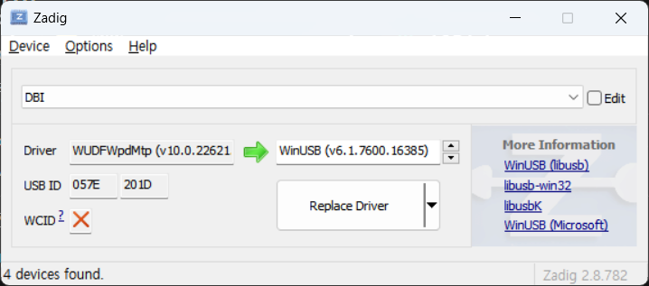

# MTP-Utils-Libarary
C++ library for using LIBMTP.

# Overview

There are tools which make us to use MTP on CLI in Windows but most of them did not work except mtp-tools by jabezwinston[^1]. The mtp-tools is not efficient since it is just compiled binary of exaples of LIBMTP. The reason is following:

1. Make a new connection when sending and receiving, erasing each file.
2. Because We cannot specify device and storage, we must iterate every device and storage to find target folder.
3. We must do erase file then send new file to replace it.
And LIBMTP says "They are examples, not tools." for examples[^2].

Thus we delvelop this to use LIBMTP easily on CLI.

# Build your environment

It is most convenient to use libmtp for MTP communication. For instructions on how to use libmtp on Windows, see the following.

[Build LIBMTP and Use it](./Build_and_Use_LIBMTP.md)

After creating an environment where libmtp is available, open the folder where you want to develop in VIsual Studio. Next, create a file called `CppProperties.json` and write the following contents.

```json
{
  "configurations": [
    {
      "defines": [ "__cplusplus=201703L" ],
      "environments": [
        {
          "CYGWIN_ROOT": "C:\\cygwin64",
          "BIN_ROOT": "${env.CYGWIN_ROOT}\\bin",
          "FLAVOR": "x86_64-pc-cygwin",
          "TOOLSET_VERSION": "9.1.0",
          "PATH": 

"${env.BIN_ROOT};${env.CYGWIN_ROOT}\\usr\\bin;${env.CYGWIN_ROOT}\\usr\\local\\bin;${env.CYGWIN_ROOT}\\${FLAVOR}\\bin;${env.PATH}",
          "INCLUDE": "${env.CYGWIN_ROOT}\\lib\\gcc\\${env.FLAVOR}\\11\\include;${env.CYGWIN_ROOT}\\usr\\include;${env.CYGWIN_ROOT}\\usr\\include\\w32api;${env.CYGWIN_ROOT}\\lib\\gcc\\${env.FLAVOR}\\11\\include\\c++;${env.CYGWIN_ROOT}\\usr\\lib\\gcc\\${env.FLAVOR}\\11\\include\\c++;${env.CYGWIN_ROOT}\\lib\\gcc\\${env.FLAVOR}\\11\\include\\c++\\**;${env.CYGWIN_ROOT}\\usr\\lib\\gcc\\${env.FLAVOR}\\11\\include\\c++\\**",
          "LIBRARY_PATH": "${env.CYGWIN_ROOT}\\usr\\x86_64-pc-cygwin\\lib;${env.CYGWIN_ROOT}\\usr\\lib;${env.CYGWIN_ROOT}\\lib",
          "environment": "mingw_64"
        }
      ],
      "includePath": [
        "${env.INCLUDE}",
        "${workspaceRoot}\\**",
        "C:\\cygwin64\\usr\\libmtp\\include"
      ],
      "inheritEnvironments": [
        "mingw_64"
      ],
      "intelliSenseMode": "linux-gcc-x64",
      "name": "Mingw64"
    }
  ]
}
```

Then create a `obj` directory and create a `Makefile`. The content of `Makefile` is below.
```makefile
CC = g++
CXXFLAGS = -Wall -O3
INCLUDES = -I/usr/libmtp/include
LDFLAGS = -L/usr/libmtp/lib -lmtp

SRC_DIR = ./src
OBJ_DIR = ./obj

TARGET = ./bin/main

HPP_SRCS = $(notdir $(wildcard $(SRC_DIR)/*.hpp)) 
CPP_SRCS = $(notdir $(wildcard $(SRC_DIR)/*.cpp))
GCHS = $(HPP_SRCS:=.gch) 
OBJS = $(CPP_SRCS:.cpp=.o)

PRECOMPILED_HEADERS = $(patsubst %.hpp.gch,$(OBJ_DIR)/%.hpp.gch,$(GCHS)) 
OBJECTS = $(patsubst %.o,$(OBJ_DIR)/%.o,$(OBJS)) 
DEPS = $(OBJECTS:.o=.d) $(PRECOMPILED_HEADERS:.gch=.d)

all : $(TARGET)

$(OBJ_DIR)/%.o : $(SRC_DIR)/%.cpp
	$(CC) $(CXXFLAGS) $(INCLUDES) -c $< -o $@ -MD $(LDFLAGS) 

$(TARGET) : $(OBJECTS)
	$(CC) $(CXXFLAGS) $(OBJECTS) $(INCLUDES) -o $(TARGET) $(LDFLAGS)

.PHONY : clean all
clean:
	rm -f $(OBJECTS) $(PRECOMPILED_HEADERS) $(DEPS) $(TARGET)

-include $(DEPS)
```

The completed directory tree looks like this
```
<Dir>
│  CppProperties.json
│  Makefile
│  README.md
│
├─.vs
│  │  ...
│  │
│  └─...
│
├─bin
│      *.dll
│
├─obj
└─src
```
> [!NOTE]
> You should use Cygwin to compile.

# Usage

## Preparing

### How to build

1. Create a environment where you can build and use LIBMTP.
2. Edit `main.cpp`.
3. Use `make` in Cygwin.

### Driver settings

1. Connect MTP device to PC.
2. Install Zadig[^3] and run it.
3. Click Options → List All Devices then choose a target device.



4. Replace its driver with `WinUSB (v6.1.7600.16385)`

> [!NOTE]
> If you want to change the driver back to the original, you can find DBI in Device Manager and select Uninstall Device (Uninstall Driver).

## Document

[mtp-utils Document](./MTP_Utils_Document.md)

[^1]: https://github.com/jabezwinston/mtp-tools
[^2]: https://github.com/libmtp/libmtp
[^3]: https://zadig.akeo.ie/