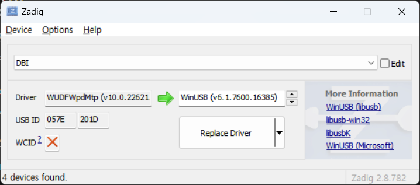

# MTP-Utils-Libarary
C++ library for using LIBMTP.

# Table of Contents
- [MTP-Utils-Libarary](#mtp-utils-libarary)
- [Table of Contents](#table-of-contents)
- [Overview](#overview)
- [환경 구축](#환경-구축)
- [사용법](#사용법)
  - [사전 준비](#사전-준비)
    - [빌드 방법](#빌드-방법)
    - [드라이버 설정](#드라이버-설정)
  - [Document](#document)


# Overview

윈도우에서 MTP를 커맨드로 사용할 수 있는 공개된 툴이 있지만 그것들을 사용해본 결과 대부분은 정상적으로 동작하지 않았고, jabezwinston의 mtp-tools[^1]만이 동작하였다. 이 툴은 libmtp의 examples를 컴파일한 파일에 불과하며 그렇기에 효율적이지 못하다는 단점이 존재한다. 효율적이지 못 한 이유는 다음과 같다.

1. 파일 보내기, 받기, 지우기를 수행할 때마다 연결을 새로 해야 한다.
2. Device와 Storage를 지정해 줄 수 없어, 존재하는 모든 Device와 Storage에서 폴더를 순회하는 방식으로 대상 폴더를 찾는다.
3. 대상 기기에 존재하는 파일을 교체하기 위해서는 파일 지우기와 파일 보내기를 따로 수행해야 한다.

또한, libmtp에서도 이 example들에 대해 "이것들은 툴이 아닌 단지 예제일 뿐이다."라고 말하고 있다[^2]. 

따라서 mtp를 command line으로 편하게 쓰기 위해 이 라이브러리를 개발했다.

# 환경 구축

우선 MTP 통신을 사용하기 위해서는 libmtp를 사용하는 것이 가장 편하다. libmtp를 윈도우에서 사용하기 위한 방법은 다음을 참고한다.

[libmtp 빌드 및 사용](./Build_and_Use_LIBMTP_kr.md)

libmtp를 사용할 수 있는 환경을 구축한 뒤에 VIsual Studio에서 개발을 할 폴더를 연다. 그 뒤, `CppProperties.json` 이라는 파일을 만들고 다음과 같은 내용을 작성한다.

```json
{
  "configurations": [
    {
      "defines": [ "__cplusplus=201703L" ],
      "environments": [
        {
          "CYGWIN_ROOT": "C:\\cygwin64",
          "BIN_ROOT": "${env.CYGWIN_ROOT}\\bin",
          "FLAVOR": "x86_64-pc-cygwin",
          "TOOLSET_VERSION": "9.1.0",
          "PATH": 

"${env.BIN_ROOT};${env.CYGWIN_ROOT}\\usr\\bin;${env.CYGWIN_ROOT}\\usr\\local\\bin;${env.CYGWIN_ROOT}\\${FLAVOR}\\bin;${env.PATH}",
          "INCLUDE": "${env.CYGWIN_ROOT}\\lib\\gcc\\${env.FLAVOR}\\11\\include;${env.CYGWIN_ROOT}\\usr\\include;${env.CYGWIN_ROOT}\\usr\\include\\w32api;${env.CYGWIN_ROOT}\\lib\\gcc\\${env.FLAVOR}\\11\\include\\c++;${env.CYGWIN_ROOT}\\usr\\lib\\gcc\\${env.FLAVOR}\\11\\include\\c++;${env.CYGWIN_ROOT}\\lib\\gcc\\${env.FLAVOR}\\11\\include\\c++\\**;${env.CYGWIN_ROOT}\\usr\\lib\\gcc\\${env.FLAVOR}\\11\\include\\c++\\**",
          "LIBRARY_PATH": "${env.CYGWIN_ROOT}\\usr\\x86_64-pc-cygwin\\lib;${env.CYGWIN_ROOT}\\usr\\lib;${env.CYGWIN_ROOT}\\lib",
          "environment": "mingw_64"
        }
      ],
      "includePath": [
        "${env.INCLUDE}",
        "${workspaceRoot}\\**",
        "C:\\cygwin64\\usr\\libmtp\\include"
      ],
      "inheritEnvironments": [
        "mingw_64"
      ],
      "intelliSenseMode": "linux-gcc-x64",
      "name": "Mingw64"
    }
  ]
}
```

또한, `obj`라는 디렉토리를 만들고 `Makefile`을 추가했다. 추가한 `Makefile`의 내용은 다음과 같다.

```makefile
CC = g++
CXXFLAGS = -Wall -O3
INCLUDES = -I/usr/libmtp/include
LDFLAGS = -L/usr/libmtp/lib -lmtp

SRC_DIR = ./src
OBJ_DIR = ./obj

TARGET = ./bin/main

HPP_SRCS = $(notdir $(wildcard $(SRC_DIR)/*.hpp)) 
CPP_SRCS = $(notdir $(wildcard $(SRC_DIR)/*.cpp))
GCHS = $(HPP_SRCS:=.gch) 
OBJS = $(CPP_SRCS:.cpp=.o)

PRECOMPILED_HEADERS = $(patsubst %.hpp.gch,$(OBJ_DIR)/%.hpp.gch,$(GCHS)) 
OBJECTS = $(patsubst %.o,$(OBJ_DIR)/%.o,$(OBJS)) 
DEPS = $(OBJECTS:.o=.d) $(PRECOMPILED_HEADERS:.gch=.d)

all : $(TARGET)

$(OBJ_DIR)/%.o : $(SRC_DIR)/%.cpp
	$(CC) $(CXXFLAGS) $(INCLUDES) -c $< -o $@ -MD $(LDFLAGS) 

$(TARGET) : $(OBJECTS)
	$(CC) $(CXXFLAGS) $(OBJECTS) $(INCLUDES) -o $(TARGET) $(LDFLAGS)

.PHONY : clean all
clean:
	rm -f $(OBJECTS) $(PRECOMPILED_HEADERS) $(DEPS) $(TARGET)

-include $(DEPS)
```

마지막으로 `build.sh`와 `build++.sh`를 지운 뒤의 디렉토리 구조는 다음과 같다.

```
<Dir>
│  CppProperties.json
│  Makefile
│  README.md
│
├─.vs
│  │  ...
│  │
│  └─...
│
├─bin
│      *.dll
│
├─obj
└─src
```

`CppProperties.json`파일로 인해, Visual Studio에서 자동 완성을 사용하여 프로그램을 개발할 수 있다. 또한 `Makefile`로 인해 더 빠른 컴파일이 가능하다. 다만, 컴파일을 할 때에는 Cygwin을 사용해야 한다.

# 사용법

## 사전 준비

### 빌드 방법

1. libmtp를 사용할 수 있는 환경을 구성한다.
2. visual studio로 main.cpp를 수정한다.
3. cygwin으로 해당 디렉토리에 접근한 뒤, make 명령어를 통해 빌드한다.

### 드라이버 설정

1. MTP 장치를 PC에 연결한다.
2. Zadig[^3]를 다운로드하고 실행한다.
3. Options → List All Devices를 누르고, 원하는 MTP 장치를 선택한다.



1. 드라이버를 WinUSB (v6.1.7600.16385)로 변경하고 Replace Driver를 누른다.

> [!NOTE]
> 만약 드라이버를 원래대로 변경하고 싶다면, 장치 관리자에서 DBI를 찾고 장치 제거 (드라이버 제거)를 선택하면 된다.

## Document

[mtp-utils Document](./MTP_Utils_Document_kr.md)

[^1]: https://github.com/jabezwinston/mtp-tools
[^2]: https://github.com/libmtp/libmtp
[^3]: https://zadig.akeo.ie/
